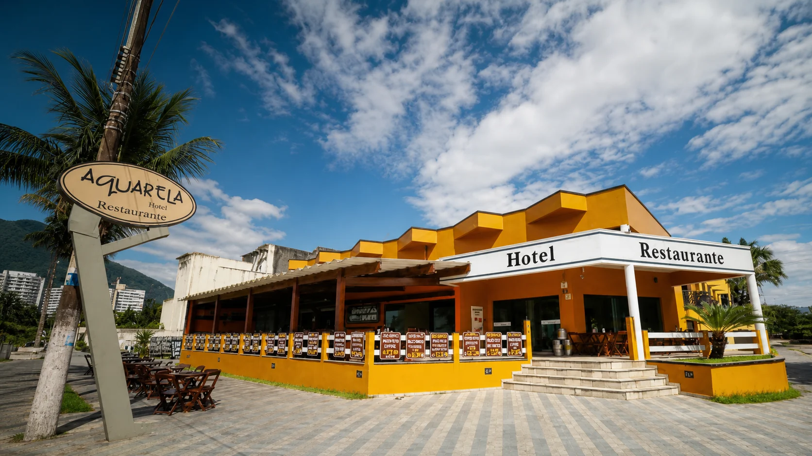

# Hotel & Restaurante Aquarela

Site institucional responsivo criado para apresentar o Hotel e Restaurante Aquarela, um negócio tradicional de frente para o mar em Peruíbe, São Paulo.



## Sobre o projeto

O projeto transforma a presença digital do Aquarela em uma experiência clara, elegante e orientada à conversão. A navegação reúne hospedagem, gastronomia, história, avaliações, localização e contato em uma identidade visual inspirada no litoral.

### Principais entregas

- página inicial responsiva com apresentação da marca e seus serviços;
- cardápio digital organizado por categorias;
- catálogo visual de acomodações;
- consulta de disponibilidade integrada ao WhatsApp;
- galeria, avaliações, mapa e canais de contato;
- cuidados de acessibilidade, semântica e desempenho de imagens;
- experiência adaptada para celular, tablet e desktop.

## Tecnologias

- TypeScript e JavaScript
- React 19 e Next.js 16
- HTML5 e CSS3
- Vinext, Vite e Cloudflare Workers

## Executando localmente

Pré-requisito: Node.js 22.13 ou mais recente.

```bash
npm install
npm run dev
```

Para gerar e validar a versão de produção:

```bash
npm test
```

## Estrutura principal

```text
app/                 entrada da aplicação React/Next.js
public/site/         experiência institucional publicada
  cardapio/          cardápio digital
  reservas/          catálogo e consulta de acomodações
  assets/            imagens otimizadas do projeto
worker/              integração com Cloudflare Workers
```

## Contexto profissional

Projeto desenvolvido como solução digital para um negócio real, com foco em identidade de marca, apresentação comercial, responsividade e geração de contatos. O conteúdo e as imagens pertencem ao Hotel e Restaurante Aquarela.
